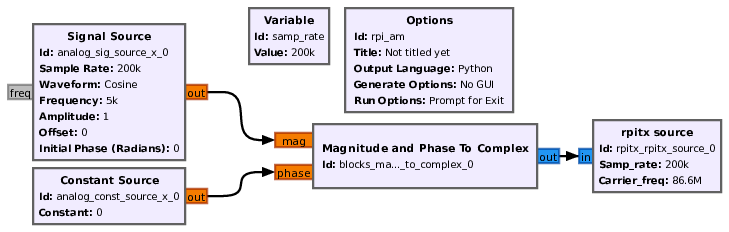

# gr-rpitx 

Using the Raspberry Pi PLL as radiofrequency source controlled from GNU Radio.

# Compiling for the Raspberry Pi target
Get the librpitx and compile

      cd
      git clone https://github.com/F5OEO/librpitx.git
      cd librpitx
      mkdir build
      cd build
      cmake ../
      make
      sudo make install
      ldconfig
      
Get gr-rpitx and compile

      cd
      git clone https://github.com/antonjan/gr-rpitx.git
      cd gr-rpitx
      mkdir build
      cd build
      cmake ../
      make
      sudo make install
      ldconfig

We need to setup the enviroment paths for gnuradio to bea ble to see your gr-rpitx
Best is to run the script sudo /home/pi/gr-rpitx/start_gnuradio-companion.sh witch includes the pathes below.
Please note you need run this as sudo if not you will get the following error

      
      export PATH=/usr/local/bin:$PATH
      export PYTHONPATH=/usr/local/lib/python3/dist-packages:$PYTHONPATH
      export LD_LIBRARY_PATH=/usr/local/lib:$LD_LIBRARY_CONFIG
      export PKG_CONFIG_PATH=/usr/local/lib/pkgconfig:$PKG_CONFIG_PATH
      /usr/local/bin/gnuradio-companion

If you run the sudo /home/pi/gr-rpitx/start_gnuradio-companion.sh

Generating: '/home/pi/rptx_traqnsmitter.py'

Executing: /usr/bin/python3 -u /home/pi/rptx_traqnsmitter.py

Peri Base = 3f000000 SDRAM c0000000
Peri Base = 3f000000 SDRAM c0000000
Peri Base = 3f000000 SDRAM c0000000
Peri Base = 3f000000 SDRAM c0000000
Peri Base = 3f000000 SDRAM c0000000
Peri Base = 3f000000 SDRAM c0000000
Peri Base = 3f000000 SDRAM c0000000
Peri Base = 3f000000 SDRAM c0000000
Peri Base = 3f000000 SDRAM c0000000
Peri Base = 3f000000 SDRAM c0000000
Peri Base = 3f000000 SDRAM c0000000
Peri Base = 3f000000 SDRAM c0000000
Peri Base = 3f000000 SDRAM c0000000
Welcome to gr-sig_gen_0-12mhz_8.jpg
Press Enter to quit: 

If you get this error you did not run it as suso

# Usage (on the target Raspberry Pi)

SampleRate 10000-250000 (as given by the author of librpitx)

Complex float input I,Q samples

Carrier frequency [Hz] in the 50 kHz to 1500 MHz range, dynamically tunable as 
demonstrated at http://jmfriedt.free.fr/gr-rpitx_set_freq.mp4

Application example: AM modulated signal using the following flowchart, generated from GNU Radio
Companion on the host PC and executed with No GUI on the target Raspberry Pi 4:

resulting in the following measurements at fundamental frequency (left) and overtone 5:

Experimental setup: NEVER EVER radiate the RPiTX output on an antenna, only measure using a wired
connection to the receiver:

Movie demonstrating the use of gr-rpitx for emitting an FM signal received by
a DVB-T dongle: https://github.com/jmfriedt/gr-rpitx/tree/main/examples/gr-rpitx_demo.mp4

# Troubleshooting

What if gr-rpitx does not work ?

1. launch python3 on the Raspberry Pi and ``import rpitx`` should not return any error. If it does, the error might be more useful than the simple ``AttributeError: module 'rpitx' has no attribute 'rpitx_source'`` provided by GNU Radio which does not tell us anything about the cause of the error. 
Most usually the error is due to /usr/lib/librpitx.so missing on the embedded board, as indicated when importing rpitx in Python3 leading to the error 
message ``librpitx.so: cannot open shared object file: No such file or directory``
2. make sure GNU Radio is properly installed on the Raspberry Pi, as validated by running Python3 on the embedded board and ``import gnuradio`` should 
not return any error message.
3. make sure *no* file named ``rpitx.py`` or ``rpitx.pyc`` is in the current directory (as would be the case if the project Id in gnuradio-companion is ``rpitx``)
